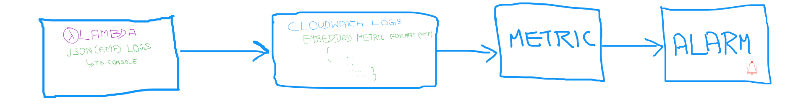
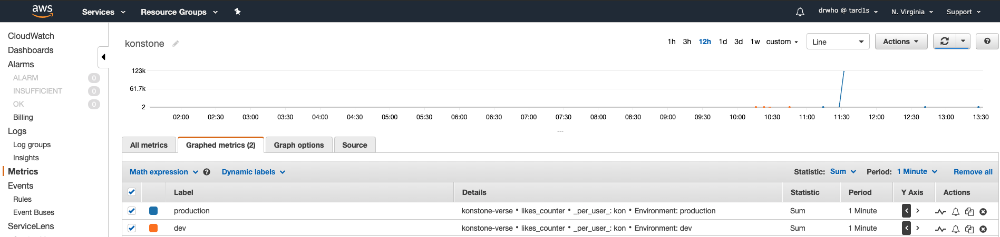

# Cloudwatch Embedded Metric for AWS Lambda

To measure the success of your applications, you need Key Performance Indicators(KPI)s. Sometimes, these KPIs have to be custom generated from logs. For examples, if you want to count the number of visitors to your page, you will need to count the pageviews(_for the sake of this demo, lets not worry about unique page view count_). You will have to count this hits from your web server logs.  

Another use-case would be where you would like to measure the latency of a call made to another services you have no control over. In those cases, you would want to measure the latency and store them in logs. Taking it one step forward, you can setup up alarms if the latency increases.

In all these cases, you are having insights in your logs, that you need to parse to get those metrics. If you are running your application AWS Lambda and storing your logs in Cloudwatch, You can take advantage of Amazon CloudWatch Embedded Metric Format<sup>[1]</sup>.



You can embed custom metrics alongside detailed log event data, and CloudWatch will automatically extract the custom metrics so you can visualize and alarm on them, for real-time incident detection.

Follow this article in **[Youtube](https://www.youtube.com/c/ValaxyTechnologies)**

1. ## 🧰 Prerequisites

    This demo, instructions, scripts and cloudformation template is designed to be run in `us-east-1`. With few modifications you can try it out in other regions as well(_Not covered here_).

    - AWS CLI pre-configured - [Get help here](https://youtu.be/TPyyfmQte0U)
    - AWS CDK Installed & Configured - [Get help here](https://www.youtube.com/watch?v=MKwxpszw0Rc)
    - Python Packages, _Change the below commands to suit your OS, the following is written for amzn linux 2_
        - Python3 - `yum install -y python3`
        - Python Pip - `yum install -y python-pip`
        - Virtualenv - `pip3 install virtualenv`

1. ## ⚙️ Setting up the environment

    - Get the application code

        ```bash
        git clone https://github.com/miztiik/cloudwatch-embedded-metric.git
        cd cloudwatch-embedded-metric
        ```

1. ## 🚀 Resource Deployment using AWS CDK

    The cdk stack provided in the repo will create the following resources,
    - API GW to front end Application running inside Lambda

    ```bash
    # If you DONT have cdk installed
    npm install -g aws-cdk

    # Make sure you in root directory
    python3 -m venv .env
    source .env/bin/activate
    pip3 install -r requirements.txt
    ```

    The very first time you deploy an AWS CDK app into an environment _(account/region)_, you’ll need to install a `bootstrap stack`, Otherwise just go aheadand   deploy using `cdk deploy`.

    ```bash
    cdk bootstrap
    cdk deploy cloudwatch-embedded-metric
    # Follow onscreen prompts
    ```

1. ## 🔬 Testing the solution

    The _Outputs_ section of the Clouformation template/service has the required information.

    - Get the `ApiUrl`,
        - It should look like `https://877bvvfqnb.execute-api.us-east-1.amazonaws.com/myst/user_id/{likes}`
    - Instead of like `{likes}` use a number between `1 to 100`,
        - For example `https://877bvvfqnb.execute-api.us-east-1.amazonaws.com/myst/user_id/69`
        - Use this Url in the browser, you should see something similar,

    ```json
    {
    "message": {
        "_per_user_": "kon",
        "Environment": "production",
        "_aws": {
        "CloudWatchMetrics": [
            {
            "Namespace": "konstone-verse",
            "Dimensions": [
                [
                "_per_user_",
                "Environment"
                ]
            ],
            "Metrics": [
                {
                "Name": "likes_counter",
                "Unit": "Count"
                }
            ]
            }
        ],
        "Timestamp": 1587907680350
        },
        "likes_counter": 69
    }
    }
    ```

    - Navigate to `CloudWatch Metric` dashboard, you will find a new namespace `konstone-verse` along with a metric `likes_counter`

    You should be able to notice graphs similar to this,
    

1. ## 🧹 CleanUp

    If you want to destroy all the resources created by the stack, Execute the below command to delete the stack, or _you can delete the stack from console as well_

    - Resources created during [deployment](#-resource-deployment-using-aws-cdk)
    - Delete CloudWatch Lambda LogGroups
    - _Any other custom resources, you have created for this demo_

    ```bash
    # Delete from cdk
    cdk destroy

    # Delete the CF Stack, If you used cloudformation to deploy the stack.
    aws cloudformation delete-stack \
        --stack-name "MiztiikAutomationStack" \
        --region "${AWS_REGION}"
    ```

    This is not an exhaustive list, please carry out other necessary steps as maybe applicable to your needs.

## 👋 Buy me a coffee

[Buy me](https://paypal.me/valaxy) a coffee ☕, _or_ You can reach out to get more details through [here](https://youtube.com/c/valaxytechnologies/about).

### 📚 References

1. [CloudWatch Embedded Metric Format](https://docs.aws.amazon.com/AmazonCloudWatch/latest/monitoring/CloudWatch_Embedded_Metric_Format.html)

1. [Specification: Embedded Metric Format](https://docs.aws.amazon.com/AmazonCloudWatch/latest/monitoring/CloudWatch_Embedded_Metric_Format_Specification.html)

### 🏷️ Metadata

**Level**: 300

[1]: https://docs.aws.amazon.com/AmazonCloudWatch/latest/monitoring/CloudWatch_Embedded_Metric_Format.html
[2]: https://docs.aws.amazon.com/AmazonCloudWatch/latest/monitoring/CloudWatch_Embedded_Metric_Format_Specification.html
